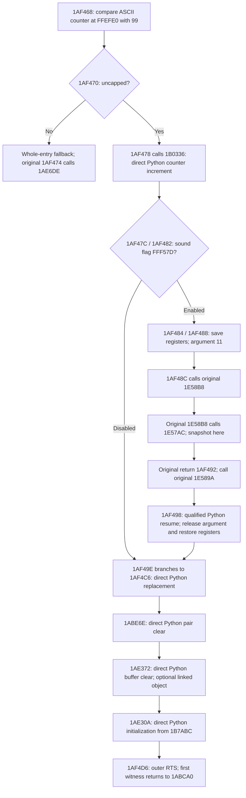

# Frozen historical evidence

This report preserves ROM mapping, qualification, and recovery decisions at its source freeze. It is not current operating guidance: use the immutable cold-start input-history workflow in [../history.md](../history.md). Current commands do not promise to load legacy replay or snapshot artifacts referenced below.

# Connected object/sound carrier experiment — 0.6.0

**Verdict: NOT CONVERGING for this expansion's scaffolding economics.** The
connected carrier works, including a snapshot inside original sound code and
a fresh-process Python continuation. It adds 58 lines to the recovered-source
file but 167 lines to dispatch and its supporting surfaces; execution crossings
also increase. This establishes a usable local legacy seam, not sustained
source-port convergence. No generic continuation runtime or native change was
needed. Further mechanical expansion is stopped at this result.

## Region selected from current evidence

Baseline is commit `4334ca4`, the 0.5.0 composed candidate. Original tracing of
the current 225.023-second user recording finds 78 entries at `0x1AF468`, all
with sound enabled. Ten increment operations roll the ASCII ones digit over;
68 do not. The counter ranges from `04` to `41` at these entries. The capped
branch is not recorded. The shared replacement tail has 88 visits, including
ten separate counted entries at `0x1AF4C2`; two tail visits have linked objects.

The chosen region owns the uncapped counter/sound/replacement path. It is not
the entire enclosing gameplay routine. RAM remains authoritative throughout.
The first real activation spans 147 original M68000 instructions: 69 are now
replaced by Python and 78 remain original within the sound span. Previously
only the final 52 instructions of this activation were replaced.



The sound span deliberately includes **both** unresolved callees and the
intervening original JSR. Python does not stop at `0x1AF492` just to send the
machine back into sound code. `increment_decimal_counter()`,
`begin_object_transition()` and `finish_object_transition()` live in
`recovered.py`; admission, mutations and return recognition stay in `recovery.py`.
The initializer, pair and buffer helpers remain ordinary direct Python calls.
No opcode interpreter, independent object graph, registry or new production
module was added.

## Concrete continuation contract

Only `object-sound-v1` is supported. Let **S** be A7 at `0x1AF468`.

| Guest location | Materialized value |
|---|---|
| S | Existing outer return PC |
| S−4, S−8, S−12, S−16, S−20 | Saved A6, A1, A0, D1, D0 |
| S−24 | Long sound argument 11 |
| S−28 | First return `0x1AF492`, later reused for `0x1AF498` |
| S−32 on nested entry | Original JSR's return `0x1E58BE` |

The accepted Python prefix leaves PC=`0x1E58B8`, A7=S−28. The persisted record
has exactly four fields: contract name, entry master tick, S, and SHA-256 of
the 28 guest bytes from S−24 through the outer return. Values come from live
RAM; saved registers are not duplicated in a mutable Python object.

While that record is pending, only the `0x1AF498` gate is armed. Original code
owns the entire sound span, including any internal or nested calls. To resume,
Python requires PC=`0x1AF498`, A7=S−24, the long at A7−4=`0x1AF498`, an unchanged
saved-frame/outer-return digest, and a current tick at least as large as the
entry tick. PC alone cannot select an activation. A hit at another stack depth
retires one original instruction and retains the pending record. A matching
stack depth with a wrong frame or return slot fails explicitly.

This contract assumes these particular callees preserve their caller's saved
frame and return normally. It does not support arbitrary unwinding, nesting of
Python carriers, arbitrary resume addresses, or a second continuation case.

Admission requires the verified USA ROM, ASCII `00..98`, and the existing
canonical/disjoint RAM and aligned stack domains. In the silent branch,
counter storage must also be disjoint from the directly composed object's
operands. Capped/invalid counters and prefix scheduler refusal execute the
original entry without committed Python effects. Suffix refusal clears the
continuation and executes **only the original suffix at `0x1AF498`**. The
counter increment and completed sound operation are retained. No rollback or
whole-entry rerun is used after a successful prefix.

## Snapshot extension and proof

The native machine already serializes the CPU, devices, guest stack and RAM.
The missing fact was Python ownership of the eventual sound return. A pending
continuation therefore adds `object-transition.json` to a version **3** `.alsnap`.
It stores the four-field activation and a hash binding it to `machine.bin`;
the manifest verifies both members' integrity. Restore validates the shape,
machine binding, tick and live saved frame before enabling continuation.

Ordinary snapshots remain version 2, replays remain version 2, and the native
state contract remains 1. Existing corpus bytes were not migrated or modified.
Raw `Machine.snapshot()` is still native-only; use the portable `.alsnap` archive
for a pending Python return. No Python frame, generator or interpreter internals
are serialized. Host PCM queues retain their existing presentation semantics:
drain before saving and compare newly generated PCM after restore.

`play --snapshot`, `resume-check`, and the normal event driver recognize a
pending carrier record. Replay qualification explicitly selects `carrier`.
The `original` reference worker intentionally relinquishes Python ownership and
executes the original suffix, providing an independent execution route from
the same guest state. Other recovery candidates reject a pending carrier save.

The real witness records this sequence:

| Boundary | Master tick / context |
|---|---|
| Python entry | 1,803,706,118; S=`0xFFEFD0` |
| Snapshot inside original nested callee | 1,803,708,008; PC=`0x1E57AC` |
| Qualified carrier's outer exit | 1,803,721,448; PC=`0x1ABCA0` |
| After 150 further original instructions | 1,803,732,998 |

The uninterrupted candidate equals original execution at the region exit and
after those 150 instructions: complete native state, frame and PCM match.
Two new worker processes then restore the inside-callee save, run original
and carrier modes, and reach the same uninterrupted final state. The carrier
receipt explicitly records one recognized legacy return, one completed suffix,
and no pending continuation. The saved suffix produces 100 PCM bytes; the
whole short witness produces 108, including the eight bytes drained before save.

## Verification evidence

All paths below are local ignored artifacts under `artifacts/carrier/`.

| Evidence | Result / scope |
|---|---|
| `coverage.json`, `measure_coverage.py` | Original-only full-corpus entry and branch trace |
| `witness-v060/report.json` | Real entry, uninterrupted equality, inside-callee save, fresh restore, 150-instruction native continuation |
| `witness-v060/{entry,inside}/comparison.json` | Both PASS; exact native state/frame/PCM/timing |
| `witness-v060/carrier-mutant-result/comparison.json` | DIVERGENCE: wrong counter result changes RAM/state |
| `witness-v060/carrier-mutant-continuation/comparison.json` | CANDIDATE_ERROR: wrong guest return executes invalid continuation |
| `witness-v060/carrier-mutant-timing/comparison.json` | CANDIDATE_ERROR: adding two cycles makes the exact terminal tick unreachable |
| `edit-loop/result.json` | Real disposable Python edit `ones + 1` → `ones + 2`: PASS → DIVERGENCE in 0.619 s; zero builds/installs |
| `full-{baseline,carrier}/comparison.json` | Both PASS, all 225 ordered observations and terminal/full PCM |
| `installed-{inside,full}/comparison.json` | Installed 0.6.0 also PASS; source module hashes match checkout |
| `region-counts.json` | Original instruction count and exact fixture/ROM byte check |
| `economics.json` | Before/after measured counts and LOC method |

The Python suite has **249 passing tests**. New coverage includes nine original
ROM prefix/counter/tail differential combinations: `00`, `09`, `98` crossed with
sound flags `0`, `1`, `0x80`. Their sound callees are explicitly synthetic
clobbering stubs. Real sound code is qualified by the witness and full replay.
Other new tests exercise foreign stack depths, corrupted frames and return slots,
local fallback, invalid/capped counters, alias rejection, and corrupt or mismatched
snapshot metadata. The architecture boundary check passes.

The current full replay contains 1,008 input events and ends at tick
12,082,203,375. Its SHA-256 is
`f51c9192d35a1ed2d8839e5b04a747d61962860f6036ae90cde708ddb3965891`.
Both modes match state
`34af78131fd69200ed1b9bf6817ebaca53e76e368e5ffe5cfff9cfb3f6acd6e8`,
frame `d51bd1fb5a77cb7a6f41cef752a820c9e7e1a5484e1984c87083f2204ac047fa`,
and 47,945,248 PCM bytes with hash
`878623149f19c75892fa5ef52833419e53df5096f4248ab12e27688de9200f16`.

The installed player completed bounded 60-frame original/audio, carrier/audio
and carrier/muted smoke checks (`player-checks/`). One earlier audio-enabled
run wrote a zero-underrun report but stalled during shutdown and was interrupted.
The stall did not recur in those bounded checks; its cause remains unresolved.
This is not a subjective audio or hardware-accuracy claim.

## Scaffolding economics

The old `composed` configuration remains available as the measured baseline.
Both whole-run measurements use the same current source/DLL, observation and
diagnostic settings. An execution crossing is either direction of a `run` or
`atomic` API call, hence `2 × (run + atomic)`. All-API counts additionally include
inspection, audio drains, gate configuration and snapshots, sampled before final
result hashing. They exclude library construction/destruction. Direct Python
calls count composed semantic helpers, excluding RAM/CCR/validation utilities.

| Whole replay metric | Before: composed | After: carrier |
|---|---:|---:|
| Simultaneously active gates | 7 | 7 outside sound; 1 inside |
| Distinct configured gate addresses over run | 7 | 8 |
| Gate stops | 2,025 | 2,103 |
| Admitted atomic stages | 1,991 | 2,069 |
| Python/native execution crossings | 35,136 | 35,448 |
| All measured Python/native API crossings | 247,396 | 250,194 |
| Gate-set API calls | 1 | 155 |
| Owned Python→legacy→Python spans | 0 | 77 entries / 77 returns |
| Direct semantic Python calls | 871 | 1,017 |
| Fallback activations | 34 | 34, including 6 local suffix fallbacks |
| Replaced M68000 instructions | 56,796 | 58,102 |
| Recovered-source LOC, including existing machine adapters | 331 | 389 |
| Dispatch/policy LOC: `recovery.py` | 160 | 275 |
| Supporting LOC: machine, artifacts, CLI, frontend | 838 | 890 |
| Special continuation contracts | 0 | 1 |
| Special legacy save/restore frame adapters | 0 | 1, with prefix/resume halves |
| Existing six region effect builders | 6 | 6 retained |
| Additional counter timing/CCR recipe | 0 | 1 |
| Same-witness unedited comparison latency, one sample | 0.649 s | 0.606 s |

LOC is physical lines including comments/blanks. The recovered-source row is
an upper bound on game LOC: it still mixes semantics with exact stack/register/
timing effects. It must not be read as 389 lines of clean game logic. Production
dispatch/support grows by 167 lines versus 58 in that mixed game-source file.
The witness script and tests are separate qualification code, not runtime glue.

On the **same short witness**, stops rise from 1 to 2, execution crossings from
8 to 12, and all measured API crossings from 88 to 124. Direct semantic calls
rise from 3 to 5 and replaced instructions from 52 to 69. A full legacy span
still executes two original sound callees. The counter helper's guest call
disappears in 77 admitted prefixes; one of the 78 recorded entries falls back
before admission. All 77 legacy returns are recognized; 71 suffix plans are
admitted, six delegate locally because of scheduling. No domain fallbacks or
foreign-return matches occurred in the full replay.

There are concrete savings: the carrier no longer arms `0x1AF4C6`; replacement,
pair, buffer and initializer calls stay inside the recovered suffix; there is
no Python bridge between the two sound calls; the overwritten counter-helper
return slot and transient ASCII `:` write need no reconstruction. Existing
pair/initializer gates remain necessary for unrelated callers. The old tail
gate survives only in the explicit baseline/standalone comparison modes.

Those savings do **not** offset the entry/resume dispatch, saved-frame identity,
snapshot ownership metadata, gate switching and per-stage admission bookkeeping.
The edit-to-verdict loop remains 0.606 s for PASS and 0.619 s for the wrong-result
edit, without native rebuilding or reinstalling. These are single local samples;
latency differences do not establish a speedup. Source DLL SHA-256 stays
`e801a550885dc598c2a5b84941b6c92c803267c4e49ef4b57660163c251b430a`.
The separate final package installation is outside this measured development loop.

## Architecture decision

**NOT CONVERGING.** This is a verdict about this measured expansion, not proof
that progressive recovery is impossible. A larger editable region, direct
composition, local fallback and a snapshot-safe legacy return all work. But
dispatch grows 72% while the mixed recovered-source file grows 18%, and even
the focused path makes more machine crossings. Calling this convergence would
hide the dominant cost.

The structural cause is the current ownership boundary: an unresolved sound
operation splits execution into two independently admitted exact machine-effect
plans. Each side still reconstructs guest effects and the dispatcher must carry
return ownership across the gap. Full RAM/register/timing equivalence leaves
most old per-function adapters observable at the new exit, so they were retained.
One real continuation case is insufficient to assume its cost will amortize.

Do not add a registry, scheduler exceptions, or more resume IDs in response.
The next investigation should use this same witness to determine which existing
effect-building adapters can actually disappear under larger ownership before
adding another seam. If none can disappear without weakening the contract, that
is a limitation of this recovery model to state explicitly, not framework work
to conceal. The capped branch, other sound callers, and the enclosing routine
remain unrecovered.

## Reproduce

```powershell
$env:PYTHONPATH = "$PWD/src"
$env:ALADDIN_NATIVE_LIBRARY = "$PWD/build/libaladdin_native.dll"
.\.venv\Scripts\python.exe scripts\carrier_witness.py --output artifacts\carrier\witness-v060
.\.venv\Scripts\python.exe scripts\dev.py compare artifacts\carrier\witness-v060\witness.alreplay --candidate carrier --diagnostics --output artifacts\carrier\short
.\.venv\Scripts\python.exe scripts\dev.py compare recordings\current\20260912T210640.729016Z.alreplay --candidate carrier --diagnostics --output artifacts\carrier\full-carrier
.\play.cmd --snapshot artifacts\carrier\witness-v060\inside.alsnap
```
