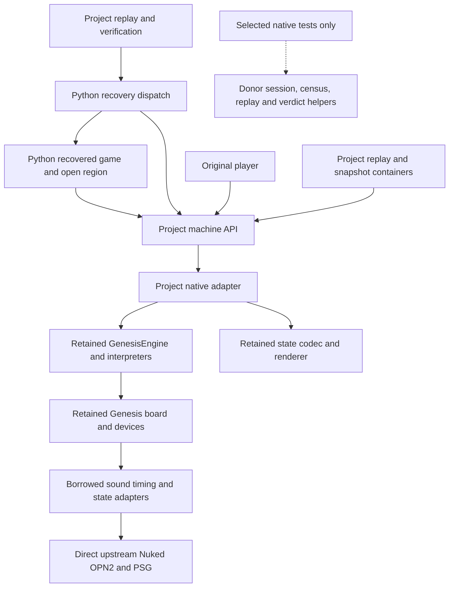

# Frozen historical evidence

This report preserves ROM mapping, qualification, and recovery decisions at its source freeze. It is not current operating guidance: use the immutable cold-start input-history workflow in [../history.md](../history.md). Current commands do not promise to load legacy replay or snapshot artifacts referenced below.

# Component inventory and migration ledger

Audit: 13 September 2026, Windows x64 / MinGW 12.2 / Ninja. The input revision
was `3b9cc76`; working build and Python files were preserved before changes.
This is a bounded cleanup followed by recovery verification, not an engine rewrite.

## Architecture and actual dependency graph



`scripts/audit_dependencies.py` reads Ninja compiler dependency records and
resolves quote-include edges among observed files. It filters out obsolete
objects left in Ninja's dependency database using the active target graph.
System compiler headers are excluded. The checked-in
[actual graph](../../third_party/dependencies.json) records every active object,
project/donor file, runtime/test use and resolved include edge. Recreate it after
native dependency changes:

```powershell
.\.venv\Scripts\python.exe scripts\audit_dependencies.py `
  --donor D:/Games/DOS/dos_recosystem/aladdin_sega_forged/port_forge `
  --output third_party/dependencies.json
```

Before: 29 donor runtime files, of which two were compiled sound cores. After:
27 donor runtime headers, plus project adapter/generated identity and four direct
upstream C/header inputs: **33 compiler-observed runtime files**. Native tests
use 46 donor files plus four direct upstream inputs: **50 files**. The 19 donor
files beyond the runtime closure are test-only. Original notices are pinned
build inputs but do not appear in compiler dependency records.

Direct native includes are `host/genesis_engine.hpp`, `platform/genesis/snapshot.hpp`
and `platform/genesis/render.hpp`. Engine reaches the board, interpreters,
`core/run_end.hpp`, `replay/run_ending.hpp` and `host/admission_observer.hpp`.
M68000 interpreter reaches `core/observe.hpp`. These last four headers are real
runtime framework residue even though no project replay uses their policies.

`genesis_snapshot_codec_units.cpp` and
`genesis_scheduler_continuation_units.cpp` include `host/genesis_session.hpp`.
That test path pulls in census, input delivery, session recording, authority
codec, JSON/I/O and verdict helpers. It is absent from the native DLL's dependency
records. Directory labels alone would have overstated runtime framework use.

## Component decisions and removal triggers

All retained donor paths below are relative to the pinned source root in
[the donor lock](../../third_party/sources.json). The exact dependency edges and
per-file hashes are in the linked graph and locks rather than duplicated here.

| Component / source | Scope and reason | Class / current owner | Action and next trigger |
|---|---|---|---|
| `arch/m68k/{interp,alu,machine,timing_68000}.hpp` | Runtime; original execution and timing oracle | KEEP-WHILE-USEFUL; donor implementation, project API | Retain verified interpreter. Reconsider for measured control/performance/correctness limits; no fresh CPU port. |
| `arch/z80/{cpu,interp,alu,timing_z80}.hpp`, `genesis/z80_box.hpp` | Runtime; original sound driver and banked bus | KEEP-WHILE-USEFUL | Retain. Sound driver recovery and CPU replacement are separate decisions. |
| `platform/genesis/{machine,machine_profile,io,refusal}.hpp` | Runtime; one RAM/bus/device authority and selected board configuration | ABSORB-CANDIDATE; donor implementation | Absorb a coherent board slice when a concrete device/bus change needs it. No shadow machine. |
| `platform/genesis/{vdp,render}.hpp` | Runtime; VDP state and sampled frames | ABSORB-CANDIDATE | Keep working renderer; targeted absorption when raster behavior or rendering edits demand it. Current evidence is not raster fidelity. |
| `host/genesis_engine.hpp` | Runtime; IRQ admission, CPU/Z80 scheduling, gates and atomic operation admission | KEEP-WHILE-USEFUL | Keep behind native ABI. Extract scheduling glue when an actual change or framework dependency blocks recovery. |
| `core/observe.hpp`, `core/run_end.hpp`, `replay/run_ending.hpp`, `host/admission_observer.hpp` | Runtime via interpreter/engine; observation interfaces and ending/admission types | FRAMEWORK-GLUE; isolated donor residue | Do not expose to Python. Remove with interpreter/engine extraction; no separate scheduler solely to delete four headers. |
| `platform/genesis/snapshot.hpp`, `ym3438_state_fields.inc`, `core/sha256.hpp` | Runtime; explicit state codec and identity hashing | ABSORB-CANDIDATE | Native boundary owns validation/opacity. Absorb codec when state changes require editing it; bump state contract and regenerate. |
| `platform/genesis/nuked_{ym2612,psg}.hpp` | Runtime; chip clocks, mixing and state adapters | ABSORB-CANDIDATE | Retain timing adapter. Absorb when chip ABI/timing changes or board extraction requires it. |
| `third_party/nuked_opn2/{ym3438.c,ym3438.h}` | Runtime and tests; independent FM core | DIRECT-UPSTREAM; directly vendored | Migrated compiled source to project. Pinned upstream revision, notices and no patches. |
| `third_party/nuked_psg/{ympsg.c,ympsg.h}` | Runtime and tests; independent PSG core | DIRECT-UPSTREAM; directly vendored | Migrated compiled source to project. Pinned upstream revision, notices and no patches. |
| Donor copies of the two Nuked `.h` files | Runtime declarations through borrowed wrappers | Temporary declaration bridge | Build enforces byte equality with direct headers. Remove when wrappers are absorbed, before changing core ABI. No duplicate compiled core. |
| `host/genesis_session.hpp`, `platform/genesis/code_census.hpp`, replay `{boundary,identity,input_delivery,input_script,session_recording,verdict_record}.hpp`, core `{authority_codec,io,json}.hpp` | Native test-only helper closure | FRAMEWORK-GLUE; donor test dependency | Removed from runtime lock requirements. Retain tested codec/continuation fixtures; trim only if replacing those tests provides equivalent evidence. |
| `arch/m68k/static_decoder.hpp`, seven `tests/*_units.cpp` | Native test-only processor/device/render/state/continuation checks | KEEP-WHILE-USEFUL | Retain existing useful regression coverage. No test deletion counted as machine recovery. |
| `native/machine.cpp`, `machine.py` | Runtime project ABI; allocation, gates, atomic writes, snapshots, PCM | Project-owned | Preserve small interface and one state authority. No donor types beyond native boundary. |
| `profile.py`, `artifacts.py`, `verification.py`, `receipt.py` | Project profile, containers, observations and provenance | Project-owned | Removed donor profile labels and source-transition table. Version 2 containers; one state contract. |
| `recovered.py`, `recovery.py` | Game behavior versus dispatch/qualification policy | Project-owned | Split for normal Python edits. Next recovery adds connected behavior without a new registry or IR. |

## Leakage ranked by practical effect

1. **Migration friction, removed:** exact-source transition tables and profile
   donor commit/codec labels forced qualification machinery onto harmless source
   changes. Replaced by explicit state contract plus independent provenance;
   unsupported early files regenerate instead of acquiring permanent readers.
2. **Dependency indirection, reduced:** independent sound implementations were
   compiled through PortForge's vendor tree. C sources now link directly; original
   notices are local. Borrowed wrappers/header declarations remain explicitly tracked.
3. **Build coupling, removed from runtime requirements:** a 52-file undifferentiated
   lock made runtime-only builds require session/census/verdict/test files and
   donor sound notices. Runtime/test locks now match compiler use; direct notices
   live with their independent cores.
4. **Editability, improved:** real game calculations and candidate mutants shared
   one class/module. Editable game functions now stand alone, with explicit legacy
   exit and a directly composed clear helper. Qualification policy stays outside.
5. **Engine residue, retained:** four framework headers and native region/admission
   types still compile through retained engine/interpreter code. They neither
   appear in project Python nor block the leaf/composed experiment. Extract only
   when that integration actually needs modification.
6. **State layout, contained:** the native codec still comes from the donor, but
   Python does not inspect its private offsets. Native timestamp validation and
   atomic import remain tested. No new snapshot decoder was introduced in Python.

## Evidence and bounded next work

Before/after native builds agree on all 225 ordered state/frame/PCM observations
for the regenerated 225-second user input stream. Both use the same new behavioral
profile; the original stored state hashes contain old profile metadata and are
not directly comparable. Frame and complete PCM hashes remain equal to the
historical run. The migration comparison is an offline experiment with a
preserved build, not a permanent dual backend.

The actual Python leaf and open composed region remain exercised by this same
corpus. Short gate/continuation witnesses, explicit legacy-exit tests and an
edit-to-divergence check validate the new module boundary. See
[STATUS.md](../STATUS.md) for exact reports, counts and limits.

Next: expand the detach region into its explicitly unresolved script path and
qualify a real continuation at that seam. Absorb board/sound adapters only if
that work exposes a concrete need. No Linux port, CPU rewrite or architecture
framework is a prerequisite.
