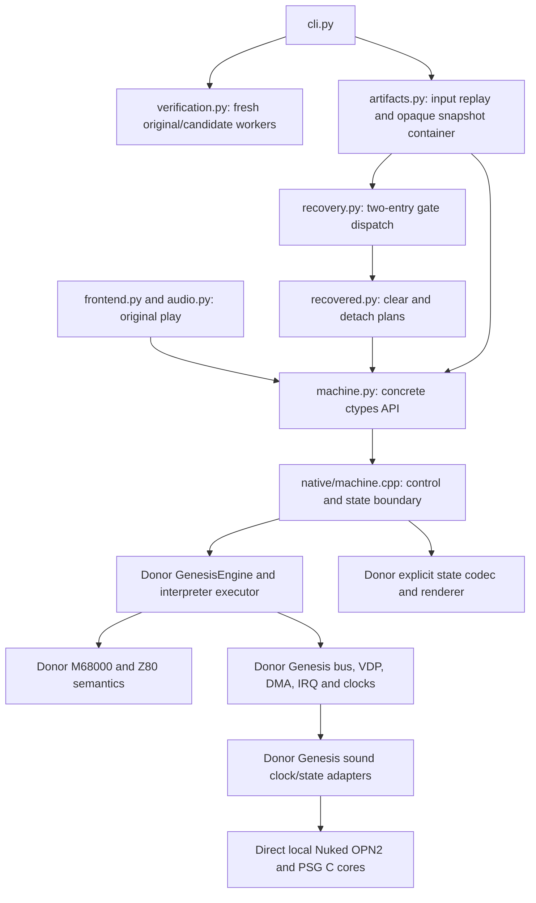

# Frozen historical evidence

This report preserves ROM mapping, qualification, and recovery decisions at its source freeze. It is not current operating guidance: use the immutable cold-start input-history workflow in [../history.md](../../common/history-and-replay.md). Current commands do not promise to load legacy replay or snapshot artifacts referenced below.

# Is this the smallest useful Aladdin recovery system?

Review of **8be021f**, 13 September 2026, Windows x64. The working tree was clean
at intake. This review inspected current Python/C++, refreshed the compiler graph,
checked dependency bytes and the architecture guard, and measured actual execution.
Runtime code, native binaries and artifact formats were not changed by this review.

**Follow-up implemented:** version 0.2.1 adds opt-in terminal/failure diagnostics,
register/RAM differences, retained replay/snapshots and fallback-reason counts.
The unused CLI options and candidate aliases listed below were removed. The
findings below describe the reviewed `8be021f` baseline; see STATUS for the
subsequent validation. No new machine primitive or continuation registry was added.

**Mostly yes at the machine boundary; not yet demonstrated at recovery scale.**
There is one concrete Machine, one native adapter and one production implementation
per hardware responsibility. No generic backend hierarchy, carrier registry or
migration chain is present. Replacing the engine would add work without resolving
the current recovery limits. The two recovered entries are a useful control proof,
but still too small and too dependent on guest stack/timing details to establish
that surrounding scaffolding will remain small as the source grows.

The immediate priorities are better failing-witness diagnostics and the next
connected game calculation. Do not start another hardware migration or create a
generic continuation system from the older specification's example APIs.

## A. Actual architecture

`profile.py` selects one ROM and behavioral configuration. `receipt.py` identifies
exact executions. The verification worker dispatches via the same replay driver;
no second game runtime calculates the candidate's answer. Python reads native RAM
through a live view, with an immutable ROM copy. Staged effects are temporary
calculations, not a second authoritative object graph.

The refreshed active-object compiler graph exactly matches
[third_party/dependencies.json](../../../third_party/dependencies.json): 33 runtime files
(27 donor headers, four direct sound source/header inputs, adapter and generated
identity), and 50 native-test files. System headers are excluded. The audit reads
Ninja dependency records and filters stale objects; it does not infer use from the
lock. [The component ledger](../aladdin/component-migration.md) lists the full dependency groups.

## B. Necessity and deletion audit

| Current files / mechanism | Classification | Current Aladdin requirement; deletion condition |
|---|---|---|
| `recovered.py` | ESSENTIAL NOW | Editable buffer clear and detach behavior. Game calculations survive; register/stack/cycle bridges shrink only as adjoining code and the comparison contract permit. |
| `recovery.py`, entry gates, `AtomicPlan` admission | TEMPORARY SCAFFOLDING | Substitute known Aladdin entries while preserving original execution elsewhere. Delete each gate/bridge when its callers and continuation are owned by direct source. Atomic admission may remain while guest timing is part of the contract. |
| `machine.py`, `native/machine.cpp`, `profile.py` | ESSENTIAL NOW | One controllable machine, ROM identity, live state, finite execution, restore and effects. Final port can retain platform APIs; original-CPU gates and instruction accounting can eventually disappear. |
| `artifacts.py` | ESSENTIAL NOW | Deterministic user inputs and safe saves. Save/replay support may remain useful in the port; recovery cursor/qualification details must not grow into a generic session system. |
| `verification.py`, `receipt.py` | USEFUL NOW | Independent workers, first failing interval, negative controls and exact reproducibility. Keep as offline tests/tools after recovery, not mandatory frame-loop services. |
| `frontend.py`, `audio.py`, launchers | ESSENTIAL NOW | Obtain user gameplay and uninterrupted host audio; resume saves. Presentation remains part of the source port. The FIFO solves an observed problem. |
| `cli.py`, package entry points, CMake/packaging | ESSENTIAL NOW | Repeatable launch/build and worker commands. The unused options below are separable from this legitimate need. |
| `scripts/dev.py`, `recovery_witness.py`, `edit_loop_check.py` | USEFUL NOW | Fresh source imports, parked real entries, short suffixes, mutation detection without rebuilding. Keep offline while original comparisons help; no general workflow engine needed. |
| `check_sources.py`, `export_sources.py`, `audit_dependencies.py` | USEFUL NOW | Locked donor bytes, local runtime-only build handoff and actual inclusion audit. Donor export/audit support can disappear if no donor checkout is needed. |
| `check_architecture.py`, `tests/test_architecture.py` | USEFUL NOW | Cheap check against demonstrated donor coupling risks. Keep small; no dependency-analysis framework is justified. |
| `capture_smoke.py` | USEFUL NOW | Small labeled synthetic boot/input fixture, independent of private human captures. It is not evidence of human gameplay. |
| Existing processor/device and Python regression tests | USEFUL NOW | Protect gate, timing, sound, restore and recording behavior. Do not count test deletion as recovery progress. |
| M68000/Z80, VDP/board/renderer/codec, Nuked cores | EXTERNAL SOLVED PROBLEM | Supply working machine behavior. Reuse is justified; the donor console model is not independently established hardware truth. |
| Unread `--headless`, `--fresh-process`, single-choice `--mode`; unused candidate aliases | UNNECESSARY / LEGACY | Parsed but do not select behavior, or lack current callers. Delete during the next small CLI/dispatch edit; update example commands and forwarding tests together. |
| Hypothetical backend/provider/device/evidence registries | PREMATURE ABSTRACTION | None found in current runtime. Do not build them. Old example names in the spec are not outstanding implementation requirements. |

At intake the package is 1,688 physical lines, native adapter 307 and scripts 677.
`recovered.py` is 180 lines and dispatch is 138. These counts include comments and
are context, not a score. Five existing docs total 1,305 lines, including a 782-line
spec: the clearest excess is stale prescriptive planning, not a large runtime
framework. This review corrects its emitter/continuation/registry implications.

## C. Machine implementation versus recovery control

The project needs control over every row used by recovery, but **does not need to
own the implementation** of any hardware row merely for that control.

| Component | Current implementation / origin | Own implementation? / required control | Current limitation | Direction |
|---|---|---|---|---|
| M68000 | Donor `arch/m68k` interpreter | No / finite run, pre-instruction gates, registers and effects | Instruction-level model; replacements only bounded RAM plans, not arbitrary bus operations | KEEP; REPLACE-IF-LIMITING |
| Z80 | Donor interpreter plus Genesis `z80_box` | No / time, reset/bank state and save continuation | Original driver still executes; shared-RAM access restricts atomic plans | KEEP |
| VDP | Donor `platform/genesis/vdp.hpp` | No / deterministic time, state and output | No independent raster-fidelity qualification | KEEP; ABSORB-WHEN-USEFUL |
| DMA / IRQ | Donor board, VDP and GenesisEngine | No / preserve admission order and observer boundaries | Native-operation admission can decline near relevant events | KEEP; no parallel Python scheduler |
| Bus / mapping | Donor Genesis machine | No / live work RAM and deterministic effects | No public general bus/MMIO read/write API; current regions need neither | KEEP; add only a demonstrated access |
| Scheduler | Donor GenesisEngine | No / run-to-limit, stop/continue and persisted scheduler latches | Framework types inside adapter; atomic regions cannot cross all event boundaries | KEEP while the narrow ABI suffices |
| Renderer | Donor renderer | No / obtain frame for play and comparisons | Renders current VDP state; not a promise of a raster-complete historical frame | KEEP |
| YM2612 / OPN2 | Direct pinned Nuked OPN2; donor clock/state adapter | No chip rewrite / own master-time feeding, mixing and state boundary | Wrapper still includes identical donor core declarations | DIRECT-UPSTREAM already compiled; absorb adapter when touched |
| PSG | Direct pinned Nuked PSG; donor clock/state adapter | No chip rewrite / clock, writes, sample window and state | Same declaration bridge | DIRECT-UPSTREAM already compiled; absorb adapter when touched |
| Machine serialization | Donor field codec plus local scheduler envelope | No private codec rewrite / safe boundary, integrity and atomic restore | Native adapter knows pinned private layout; gate policy and Python continuation are not serialized | KEEP opaque; change only for a real state need |

Actual capability coverage: create/destroy and reset by recreation; time/instruction
limits; stop-before-PC and bypass-once; PC/SR/register inspection; bounded RAM and
register effects through `atomic`; deterministic pad delivery; state import/export;
frame and PCM drain. RAM can be inspected directly. Standalone register/MMIO
mutation, suspended Python continuation, and simultaneous in-process machines are
not supported. None is required to retain the two existing paths. Debug policies
such as armed gates are re-established by the worker, not restored from `.alsnap`.

## D–E. Remaining donor coupling and direct dependencies

The adapter directly includes engine, snapshot and renderer headers. Engine and
interpreter pull four generic framework headers into the runtime:
`core/observe.hpp`, `core/run_end.hpp`, `replay/run_ending.hpp` and
`host/admission_observer.hpp`. They provide observation interfaces, stop reasons
and admission records, not this project's replay semantics. `GenesisRegionBoundary`
and native-operation types occur in C++ only. Error text can retain donor wording;
no recovered function imports those types or makes decisions using their taxonomy.

Session, census, input-delivery/script, authority/JSON/I/O and verdict helpers are
**test-only**, reached through snapshot/continuation test consumers. Runtime-only
builds do not require them. They do not presently block recovery. Removing tested
engine facilities merely to delete these names would increase implementation burden.

The independent sound cores already compile directly from this repository, using
exact revisions and notices in [upstream.json](../../../third_party/upstream.json):
Nuked OPN2 `335747d…` and Nuked PSG `d15a168…`. There is no second compiled donor
sound core. The remaining indirection is the board-specific wrappers' relative
includes of donor declaration headers; the build enforces byte equality with local
headers. Those wrappers do actual master-clock, write ordering, mixing and state
work, so they are not mere forwarding wrappers.

The next direct-dependency opportunity is consequently **finishing that wrapper
boundary when touched**, not selecting new chips. Cost is a coherent sound/board
include and state-adapter extraction, not just changing two CMake paths: donor
`machine.hpp` currently includes its sibling wrappers. Own time conversion,
chip mode, sample integration and field serialization; retain upstream semantics.
Require current PCM/replay/save continuation equality and core tests, then remove
the old declarations/adapter path. Do not create permanent competing implementations.
No evidence in this review warrants broad research into alternative CPU or emulator
cores. Hardware replacement remains conditional on a concrete failing requirement.

## F. Representative recovery and convergence

The real path is `1AD0FC` → native pre-instruction gate → `Candidate.on_gate` →
`detach_object` → live RAM/ROM reads → direct `_clear_buffer_effects` call → staged
RAM/register effects → native atomic admission → original execution at the long
read from `FF7D9E`. The caller preserves the guest BSR slot and scratch stack writes.
Standalone `1AE372` entries use the same clear calculation and consume their actual
stack return. This is editable computation, not an interpreter wrapper.

For nonzero script/bit-two paths, `LegacyExit(1ABE6E, reason)` is raised before
staging effects. Dispatch catches it as `UnsupportedCandidate`, counts a fallback,
bypasses the caller's first opcode and resumes original code. **It does not call
1ABE6E and resume a suspended Python caller.** The target/reason is currently lost
from aggregate statistics. This is an open domain with whole-entry fallback;
calling it a general resumable open carrier would overstate the implementation.

Fresh full measurements again give 581 admitted caller plans plus 459 standalone
leaf plans, nine fallbacks and 27,579 replaced M68000 instructions. That is only
**0.0196%** of the 140,704,253 modeled M68000 instructions in this corpus. Z80
execution remains separate. There are 1,049 Python gate dispatches, not 581 total.
Composition removes 581 internal leaf gate transitions relative to independently
hooking both entries (the prior combined-gate baseline was 1,630). It does not
reduce gates relative to leaf-only mode, which has 1,047.

Scaffolding is **roughly stable, with one demonstrated local reduction**, not yet
shrinking at scale. The preceding module split changed 313 recovery lines into
138 dispatch + 180 game lines; it clarified ownership rather than deleting work.
Native adapter length changed 304 → 307 for the state contract. The earlier removal
of compatibility tables was real infrastructure deletion, but not removal of
original game execution. No new continuation IDs or registries were needed here.

The 46-byte clear and 60-byte caller region are still much smaller than their
strict-effect/timing scaffolding. This fixed cost is justified as an initial proof,
not as a per-function template to reproduce hundreds of times. Next composition
must share those bridges, increase ordinary Python logic and avoid a new framework.

## G. Measured iteration cost

Measurements use the current source/DLL and existing regenerated user witnesses.
Restore/export/frame figures are warm medians of 25 calls; receipt uses ten.
Full runs are single instrumented samples, not statistically established speedups.

| Operation | Current measurement |
|---|---:|
| Native restore of gate snapshot | 1.15 ms |
| Validated `.alsnap` restore, including container/native checks | 2.41 ms |
| Native snapshot export through Python | 2.03 ms |
| Gate-state frame conversion | 2.84 ms |
| Execution receipt | 1.63 ms |
| Short leaf/composed comparison through `scripts/dev.py` | 1.10 / 1.09 s |
| Disposable Python edit check, direct worker launch | PASS 0.58 s → DIVERGENCE 0.55 s |
| 225-second full original / composed execution | 31.89 / 31.92 s |
| Two-worker full comparison | About 64 s estimated from those runs, plus launch/report overhead |

The native `run` calls account for 30.42 seconds of the 31.89-second original run.
This includes CPU, sound, scheduling and board work; it does not identify a slow
chip. Original replay makes 13,484 run calls, 57,185 info calls and 26,968 audio
calls. Composed replay makes 14,542 run calls, 1,049 atomic calls and 1,049 register
reads; its 64,528 info calls cost about 0.062 seconds. Counts cover `_call` during
playback/observations, excluding constructor/setup and direct identity calls.
RAM-view reads do not cross the FFI. Native code never calls Python per opcode.

The source runner's extra startup and fresh-import handling cost more than restore,
but the loop is already around one second. Preserve its stale-bytecode protection.
Repeated info calls and double serialization during size-query/export are real,
small opportunities when touched, not reasons for a persistent worker/cache service.
Full replay belongs at integration checkpoints; use the existing short witnesses
for edits. These measurements justify no machine rewrite or hardware optimization.

## H. Cleanup and diagnostics

| Bucket | Bounded action |
|---|---|
| DO NOW | Use short witnesses for edits; clarify fallback versus true call/resume (documentation corrected here). Next tooling change: add a small failing-witness PC/SR/register and first-changed-RAM report using existing live APIs, preserving an opaque machine snapshot and replay suffix. Count fallback reasons so unsupported paths and scheduler refusal are distinguishable. |
| DELETE NOW | Remove unused `--headless`, `--fresh-process`, original-only `--mode`, uncalled `leaf-wrong-*` aliases and unused imported `LEAF_LAST_PC` in the next focused CLI/dispatch patch. Retain the three exercised negative controls. No historical artifact decoder remains to delete. This review identifies deletions; it does not change the CLI. |
| DO WHEN TOUCHED | Absorb coherent sound wrappers/declarations on a sound/board change. Simplify duplicate subprocess helpers if that code needs modification. Reuse a stopped entry's info/register values if access overhead becomes material. Do not create services around them. |
| LEAVE ALONE | Existing CPU/Z80, board/VDP/IRQ/DMA scheduler, renderer, opaque codec, working host FIFO, direct Nuked cores and useful native tests. |

The production comparator currently stores tick anchors and state/frame/PCM hashes,
not PC/register/RAM samples. The deliberate edit's report only identifies a state
hash mismatch at tick 165,060,106. It cannot name the first changed RAM address or
produce the prior matching snapshot automatically. The parked witness already
reproduces this failure, so a small diagnostic command over the existing boundary
is sufficient; no EvidenceStore, trace database or snapshot-layout decoder is needed.
For device-only mismatches, report which device was actually inspected; private
opaque bytes alone cannot justify a guessed device diagnosis.

## I. Smallest next capability

For the adjacent `1ABE6E` clear-object-pair calculation, **no new machine primitive
is demonstrated necessary yet**. The local donor's authored body confirms it clears
the current object and optionally the linked object using the already-known clear
helper. Treat that body as discovery evidence, not qualified Python output. First
recover a conservatively bounded RAM-only plan using current registers, live reads,
ordered effects and admission; qualify aliases, stack writes, timing and returns.
Do not copy its per-instruction region framework or assume the current corpus
covers the new branch.

If a larger region actually needs an original callee between recovered portions,
the missing capability is one **specific, snapshot-safe call/return route**, not a
new backend. Materialize the guest call state, let native execution proceed, and
recognize the supported return using guest PC and stack context. Existing gates,
atomic effects and finite run already supply the low-level operations. Add only
the Aladdin-specific dispatch/continuation state proven necessary, with a snapshot
inside the original callee and altered-return test. Never assume matching PC alone
identifies an activation. General coroutine/continuation registries and public
MMIO APIs should wait for an actual unsupported effect.

## Evidence and changes in this review

Local measurements and inspected output are under `artifacts/necessity-review/`:
`measure.py`, `measurements.json`, `dependencies.json`, `file-counts.json`,
`short-latency.json`, `edit-loop/`, and original/composed observation streams.
Both full streams contain 225 equal observations and unchanged terminal state,
frame and PCM hashes; both short production comparisons pass and the source edit
is rejected without a native rebuild or install. Source hashes and binary identity
are recorded in the measurement receipt. The existing 71-test/seven-native-group
result is prior validation; that full suite was not rerun for this documentation-only
review. Dependency byte checks and the architecture guard were rerun successfully.

README, STATUS, ownership policy and recovery notes now link/reflect this review.
The specification's stale encoding/version header and automatic emitter/continuation/
registry implications were corrected. Runtime files and captures are unchanged.
