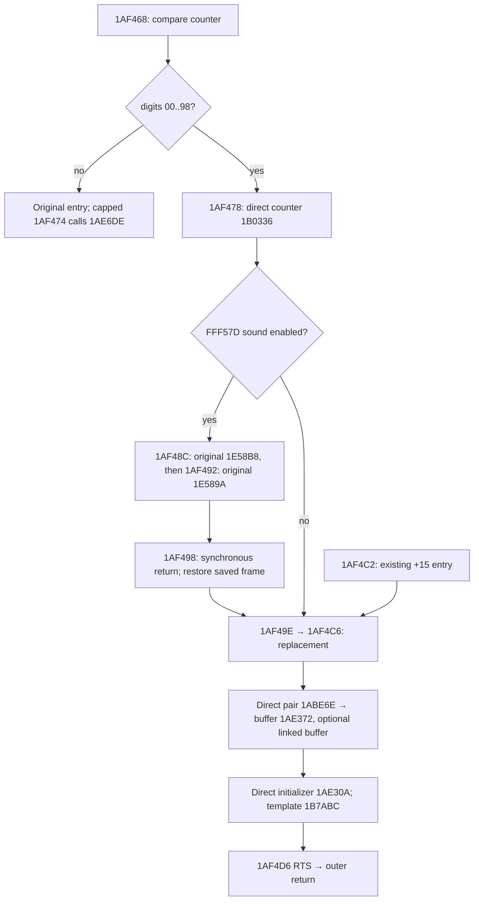

# Where exact machine semantics belong

13 September 2026. Architecture experiment, **not another recovered region**.

Recommendation: **HYBRID CARRIER + SEMANTIC ISLANDS**. Keep the existing native
executor and synchronous sound carrier. Give semantic helpers no CPU contract;
construct exact effects once at each genuinely exposed RAM-region boundary.
`AtomicPlan` remains that boundary's admission representation.

The prototype demonstrates a smaller representation of the replacement region,
but **does not yet demonstrate repository-wide amortization**. Its replacement
closure shrinks from 117 to 70 function-body lines; installing it alongside the
other current entry paths would grow production source by 70 physical lines.
Consequently it is retained as a measured experiment, not enabled as a second
production mode. Production stays at 0.7.0. Do not expand into another region
until the remaining callers of these same helpers share the semantic bodies.

## What was still relevant

The review's persistent-continuation premise was already superseded by
[0.7](synchronous-seam.md). The frozen
[0.6 evidence](carrier-convergence.md), including its negative economics verdict
and inside-callee fresh restore, remains unchanged at `evidence/carrier-v0.6.0`.
The actual baseline here is **`a72ed9e00fa8f24000e4df9fe4e3a29d4c7a68cc`**.

The remaining concern was real: `recovered.py` still mixed game meaning with
per-helper exact effects. No runtime, native backend, scheduler, snapshot format,
installed package, existing recording, or production candidate was changed here.

## Experiments and reproduction

Run from the repository root on Windows, using the existing DLL:

```powershell
.venv/Scripts/python.exe scripts/ownership_experiment.py --output artifacts/ownership/new-run
# Same checks except the three full replay comparisons:
.venv/Scripts/python.exe scripts/ownership_experiment.py --quick --output artifacts/ownership/new-short
```

The script extracts the fixed 0.7 source into disposable directories. Each
experimental package replaces just `replace_object`; the rest of the carrier,
dispatch and verification remains byte-identical. The ordinary comparison
workers hash every imported project source file, including the two prototype
modules. There is no monkeypatch of the oracle and no special comparator.

- `scripts/ownership_semantics.py`: three ordinary functions releasing buffers,
  clearing a pair and expanding the 19-byte template. No stack, CPU registers,
  CCR, cycles, instruction counts, admission, replay or snapshot policy.
- `scripts/ownership_boundary.py`: one exact adapter for the existing replacement
  tail, including its optional counted entry. Validates the existing domain,
  calls semantic functions, computes one total cost and final stack residue.
- `scripts/ownership_witness.py`: compares the actual original outer exit and
  150 further original instructions, and profiles constructed plans/helper calls.
- `scripts/ownership_experiment.py`: frozen baseline, hybrid, no-residue control,
  existing synthetic qualification, synchronous snapshot witnesses, source edit
  control and full replay comparisons. It creates no production registry/mode.

Measured evidence is under `artifacts/ownership/final/`; the first short run is
also retained under `artifacts/ownership/first/`. Generated artifacts remain
local, like the existing corpus and prior evidence; the scripts and this report
are versioned. No new ROM bytes are distributed by the experiment.

## Machine-state ownership today

| Concern | Authoritative owner | Re-expression in Python | Duplication / necessary role |
|---|---|---|---|
| PC and standing/last PC | Native CPU and scheduler | Helper plan return PC and `last_pc` | Final continuation is necessary; internal pair PC is unnecessary in the owned tail |
| A7 and stack RAM | Native CPU and live work RAM | Save slots, BSR frames, RTS adjustment in helpers | Exact outer/seam stack is necessary; nested frame history can collapse to final residue |
| D/A registers | Native CPU | Dictionaries passed through pair/leaf and restored from sound frame | Final and sound-boundary values necessary; internal dictionaries can disappear |
| CCR | Native CPU/ALU | `_logic_sr`, explicit ADD carry, helper-specific final SR | Outer X/NZVC necessary; intermediate pair/leaf flags can disappear |
| Cycles | Native machine time | Helper totals combined into outer plan | Cost prediction remains required, but ownership need not follow historical subroutine boundaries |
| Instruction count | Native counters and run limits | Helper totals combined into outer plan | Outer aggregate required by current strict identity; no need for a counter on each semantic helper |
| Ordered RAM effects | Native memory | Repeated byte writes in `AtomicPlan` | Ordering needed for observable reads/devices; no observer of overwritten RAM-only internal writes in this admitted domain |
| IRQ, raster, DMA, Z80, audio | Native machine/engine only | Deadline passed by dispatch; admission result | Python does not model a second scheduler |
| Original return identity | Guest PC/A7/frame, checked by `recovery.py` | One synchronous caller's local SP/frame values | Still necessary, stronger than PC alone; no per-semantic-helper identity |
| Snapshot continuation | Native snapshot plus ordinary archive | Ephemeral `in_sound_call` save guard | No persisted continuation in 0.7 or either prototype |

`AtomicPlan` is a data container, not another CPU. Its caller predicts effects;
native admission validates whether the stopped machine can execute that entire
span. The costly duplication is primarily **within Python**: constructing a
pair's return/register/cost contract even though only the enclosing replacement's
effects will ever be admitted. It is not two independently running schedulers.

## Same region and exact boundaries



The sound path still has two admitted Python spans separated by actual original
sound execution. The silent path still forms one admitted span. There is no
larger native atomic region than 0.7 already had. This experiment changes the
**internal representation** of an already owned region, not its machine boundary.

For sound, entry SP=S. Prefix saves A6/A1/A0/D1/D0 at S−4..S−20, argument 11 at
S−24 and return `1AF492` at S−28. Original execution reuses that return slot for
`1AF498`. Resume requires PC=`1AF498`, A7=S−24, identical 28-byte saved frame and
outer return, and the expected return slot. Foreign stack-depth returns do not
resume this activation. The 0.7 deadline and local suffix fallbacks are unchanged.

Portable saves are allowed before the carrier and after exit or an explicit
deadline handback to original ownership. They are rejected during the active
synchronous sound call. No Python activation is persisted; the frozen 0.6
launcher remains the reference for the stronger inside-callee restore capability.

## Observability, with the limits of the evidence

| Artifact | Classification and evidence | Action in hybrid |
|---|---|---|
| Outer return at S, final A7, final PC | Outer-observable; original RTS/continuation consumes them | Preserve exactly |
| Sound save frame, argument, original return slots | Legacy-seam observable; original prologue reads stack, return identity checks frame | Preserve exactly; native executes both callees |
| A6/D0 saves in internal buffer calls | Saved values are restored internally; final bytes remain in RAM | Eliminate internal save/restore choreography; retain final bytes |
| `1AF4CA` pair return overwritten by `1AF4D6` | Internal/dead history: initializer return overwrites the same slot before exit | Do not construct the earlier value |
| First pair BSR/save values overwritten by linked-buffer calls | Internal/dead history only within validated non-aliasing domain | Compute the linked branch's final residue directly |
| Final 14/18 bytes below S | Outer state observable; future game liveness unknown | Preserve; no-residue control is not accepted |
| Temporary A7 positions, A1 bridge and pair return dictionary | No unresolved execution inside the owned tail; no admitted interior observation | Replace with Python locals; one final register map |
| Intermediate pair/leaf CCR | Overwritten by initializer's final CLR; X survives from entry or counted ADD | Compute final SR once; preserve X and all non-CCR bits |
| Intermediate helper PCs | No trace or interrupt may observe an admitted interior; last PC still matters | Omit intermediate PCs; preserve outer continuation and last PC |
| Per-helper instruction/cycle totals | Individual helper totals are not independently observed here | One region formula; exact aggregate still mandatory |
| Record/buffer transient writes | Aliases rejected; initializer overwrites selected primary record fields | Last-writer reduction within this one plan |
| Unrelated scratch RAM / unresolved sound temporaries | Unknown or original-code/device observable | Do not change |

For final replacement residue (entry SP=S), the single-object branch needs:
S−4=`1AF4D6`, S−8=`1ABE74`, S−12=old A6, S−14=low D0. The linked branch needs:
S−4=`1AF4D6`, S−8=current record, S−12=`1ABE86`, S−16=old A6, S−18=low D0.
These are **final RAM values**, not live reconstructed Python/guest call frames.

Static dependency reasoning uses the existing ROM-qualified helper contracts:
all records, buffers, stack and relevant counter spans are validated disjoint;
the template is immutable ROM; semantic reads finish before atomic commit.
The final initializer overwrites its selected fields and its return overwrites
the earlier pair return. Therefore intermediate values at those same addresses
have no reader in the owned flow. The unchanged native admission conditions
exclude external observers of the interval. Full RAM equality at exit provides
an additional independent check of the derived final-state calculation.

The no-residue control leaves ten different bytes at the real witness exit:
`FFEFC2, FFEFC3, FFEFC5, FFEFC6, FFEFC7, FFEFC9, FFEFCA, FFEFCB, FFEFCE, FFEFCF`.
All ten still differ after 150 native instructions. Registers, public machine
counters, frame and PCM match there, but native snapshot identity does not.
The full recording nevertheless matches all 225 later observations. This shows
why a successful full replay alone cannot justify ignoring these bytes at a
new boundary. We have no general read-before-overwrite proof for arbitrary
future inputs or other callers. **Final residue is unknown for game liveness,
not proven dead.** The strict comparator was not changed to hide it.

## Timing and sound

The current native adapter (`native/machine.cpp`, `al_atomic`) accepts only
bounded canonical work-RAM writes and CCR-only status changes. The retained
engine also checks instruction budget, caller master deadline, raster/admission
deadline, pending IRQ, trace mode, active bus observation and VDP stalls. It
runs the Z80 around the admitted operation and synchronizes device time. A
running Z80 bank already exposing work RAM causes admission refusal; a later
unexpected work-RAM access is guarded and invalidates the operation rather than
silently accepting a mismatch. These constraints remain unchanged.

Thus **total region timing is sufficient only for this admitted RAM domain**.
The replacement cost is 712 cycles/45 instructions for a single null buffer or
876/58 for two null buffers. For each nonnull buffer of length L add 82+22L
cycles and 5+2L instructions; the counted entry adds 58/3. The witness tail is
816/52. Prefix and suffix together replace 69 instructions at 1,136 cycles.
No semantic helper returns a cycle/CCR contract in the prototype.

Per-instruction timing is still required in original sound. Static reference
code at `1E57AC` pops a return into A0, builds a frame, saves SR, sets the IRQ
mask at `1E57C6`, requests the Z80 bus at `1E57CA`, and polls `A11100` at
`1E57D2`. It also addresses Z80 memory at `A00036`/`A01B40`. Both `1E58B8` and
`1E589A` enter that code. These are real intermediate device interactions,
outside the atomic RAM-only contract. This inspection used the local generated
reference cases; execution qualification uses the real ROM/native machine.

An eventual semantic `play_sound(11)` is a plausible game interface, **not yet
a recovered platform implementation**. Its contract would need the request/flush
protocol, bus ownership, queue states, IRQ/SR restoration, polling duration and
Z80/audio effects across supported cases. Wrapping today's exact sound span in
that name would improve naming but eliminate no machine boundary. No sound
replacement or new sound API was implemented.

## Three candidate designs

### A — shared/generated machine carrier: executable design, not built

Inputs would be the verified ROM bytes and the already known CFG/entry contracts
above. Emit only the two known RAM blocks, with structured branches/direct calls;
leave the sound span in the existing native executor. Each block stages effects
and terminates in the existing `AtomicPlan`/admission call. There is no Python
opcode fetch, decoder, dispatch loop or general original-code executor.

Concrete lowering for this cluster:

1. `1AF468..1AF48C`: decoded counter branch, known helper, MOVEM/PEA/JSR effects;
   one plan ending at `1E58B8`. Unsupported capped entry remains original.
2. Reuse `Candidate._transition` verbatim for the sound run and return check.
3. `1AF498..1AF4D6` plus known callees: decoded restores, pair/buffer branches,
   template stores and final return; one plan. Resolve known calls statically.
4. Shared `_bytes`/`_logic_sr` and a block-local register dictionary suffice for
   decoded effects. An emitter must fold scratch-frame writes or provide a
   block-local write/read ledger when a later decoded operation reads them.
   That ledger is temporary execution data, not a second mutable game world.
5. Use the same native exit/synthetic/full replay checks as the implemented C.

Addresses, MOVEM ordering, register widths, stack deltas, straight-line costs,
CCR operations and final-store reduction are mechanically derivable given the
CFG. Identifying valid data/alias domains and deciding where device-visible
boundaries lie still requires recovery work. There is no qualified local Python
emitter today. Building one plus its operation library before a second concrete
need would shift cost into new infrastructure, not demonstrate amortization.
No LOC/latency/equivalence result is claimed for this unbuilt design.

### B — semantic world plus outer adapters: implemented tail/control

The three semantic functions are executable without CPU state. The outer
adapter decodes RAM inputs, validates the domain, invokes them and encodes final
state. Retaining exact final residue makes this tail identical to C below.
The more aggressive version removes the residue block altogether: 53 adapter
file lines instead of 62. That executable control fails strict exit and the
short witness, despite passing the full recording's later observations.

This does **not disprove semantic boundaries**. It rejects that specific
unproven stack omission. A fully semantic counter/sound/transition API would
still need the unresolved platform contract above. Merely moving the current
sound-frame machinery behind a semantic name would not reduce it.

### C — existing carrier plus semantic islands: implemented and qualified

The current synchronous carrier remains machine-like at its real seam. Its
replacement tail calls semantic pair/buffer/initializer behavior directly.
One outer adapter owns the final register map, residue and aggregate cost.
Known internal helpers produce no `AtomicPlan`, CCR, PC or guest frame.

This variant passes strict outer and future-state equality. It offers the
smallest demonstrated step from the present repository: no generator, new
runtime primitive, generic CPU context, native change or persistence mechanism.
It is the recommended representation, with the migration gate below.

## Measured economics

Source counts deliberately distinguish **function spans** from whole files.
Function spans include docstrings/comments/blank lines inside the definition.
The baseline replacement closure is `replace_object` (25), pair effects (32),
buffer effects (31) and initializer effects (29): 117 lines. They interleave
semantic and machine statements; calling all 117 “machine scaffolding” would
be misleading. The prototype has 20 semantic-only function lines and 50 outer
adapter function lines. All counts are handwritten; no generated-code savings
are claimed. The five shared read/address/byte/CCR helpers occupy 30 function
lines in both variants and are excluded from the closure comparison.

| Measure | Frozen 0.7 | Hybrid C | B without residue |
|---|---:|---:|---:|
| Handwritten semantic-only function LOC, replacement scope | 0 separately owned; logic mixed below | 20 | 20 |
| Handwritten mixed semantic/machine function LOC, replacement scope | 117 | 0 | 0 |
| Handwritten outer machine/guard adapter function LOC | Included in mixed 117 | 50 | 41 |
| Shared utility function LOC used by scope | 30 | 30 | 30 |
| Generated scaffolding LOC | 0 | 0 | 0 |
| Complete recovered/effect source files | 389 | 459 | 450 |
| Dispatch/policy file LOC | 231 | 231 | 231 |
| Supporting runtime LOC (machine/artifacts/CLI/frontend) | 848 | 848 | 848 |
| Combined production surfaces above | 1,468 | 1,538 | 1,529 |
| Existing selected strict qualification tests, physical LOC | 910 | 910 | 910 |
| New experiment/measurement runner LOC, shared between trials | 0 | 198 | Same 198 |
| New strict-model copy in production | 0 | 0 | 0 |
| Old exact helper function LOC still needed by other entries | 92 | 92 | 92 |
| Replacement-scope `AtomicPlan` constructors evaluated, short | 2 | 1 | 1 |
| Whole carrier plan constructions, short | 4 | 3 | 3 |
| Native atomic executions, short | 2 | 2 | 2 |
| Replacement cost-recipe owners (functions) | 3 | 1 | 1 |
| Replacement logic-CCR calculation sites | 3 | 1 | 1 |
| Replacement stack-reconstruction owners (functions) | 3 | 1 final-residue block | 0 |
| Replacement write bytes / unique addresses, short | 77 / 63 | 63 / 63 | 49 / 49 |
| Base gates / distinct including sound return | 7 / 8 | 7 / 8 | 7 / 8 |
| Gate stops, full | 2,085 | 2,085 | 2,085 |
| Gate-set calls, full | 157 | 157 | 157 |
| Python/native execution crossings, short / full | 12 / 35,248 | 12 / 35,248 | 12 / 35,248 |
| All measured API crossings, short / full | 98 / 247,180 | 98 / 247,180 | 98 / 247,180 |
| Direct semantic calls, short / full | 5 / 1,041 | 5 / 1,041 | 5 / 1,041 |
| Legacy spans entered / Python returns, full | 78 / 76 | 78 / 76 | 78 / 76 |
| Fallbacks, short / full | 0 / 4 | 0 / 4 | 0 / 4 |
| Replaced instructions, short / full | 69 / 58,652 | 69 / 58,652 | 69 / 58,652 |
| Snapshot-specific continuation records | 0 | 0 | 0 |
| Short comparison seconds | 0.681 | 0.631 | 0.659 (DIVERGENCE) |
| Full comparison seconds | 65.720 | 65.082 | 65.782 |
| Strict exit and 150-instruction native continuation | PASS | PASS | FAIL: RAM residue |
| Full replay, all 225 observations | PASS | PASS | PASS |

Crossings retain the existing convention: twice `(run + atomic)` for execution,
twice all measured API calls for API crossings. These are crossings at the public
machine API, not a count of native internal calls. The source-only semantic edit
changing buffer clear 0→1 is rejected in **0.678 s**, with the same DLL, zero
builds and zero installs. Normal standard-library bytecode caches are allowed;
disposable project sources are fresh and bytecode writes disabled. Single timing
samples are not a speedup claim. New experiment/measurement scripts are additional
qualification code, not a reduction in whole-repository LOC. The optional counted
entry also has one explicit carry/X calculation in every variant, in addition
to the logic-CCR sites counted above. Strict test LOC counts the four unchanged
files executed by the prototype runner; it excludes the pre-existing synchronous
witness and the rest of the production test suite. The new 198 runner lines
exclude the 93 prototype lines already counted as experimental production source.

**Actual deletion in the executable hybrid:** the old 25-line replacement body
is removed; its calls to the exact pair/buffer/initializer adapters disappear
from this path. The pair plan, intermediate pair register dictionary and flags,
nested BSR/save history, and 14 overwritten byte writes are no longer constructed
on the short activation. Shared byte-expansion calls fall from 26 to 11 for that
activation. This is more than relocation, but not deletion of the old helpers
from the whole program: their other gates/callers still use them.

**Not deleted:** sound frame/return recognition, gates, native transitions,
outer stack residue, final register/CCR/timing contract, alias/admission guards,
or the 92 lines of old helper definitions needed elsewhere. The disposable
package's source therefore grows by 70 lines (389→366+62+31). Production has not
been switched to that duplicate representation. There is no claim that the
entire recovery model now amortizes, or that adding more regions will fix it.

## Verification contract and evidence

- **Machine-local qualification:** the existing native tests still check leaf,
  pair, initializer, replacement and sound-frame cases. The prototype passed
  **202 existing tests**, including both replacement entries, null/non-null and
  linked buffers, maximum lengths, carry boundaries, aliases, silent/sound paths,
  foreign returns, deadline handback and atomic sound guards. Synthetic sound
  stubs are not represented as qualification of the original audio driver.
- **Carrier-boundary equivalence:** real ROM/witness entry from 0.6, all native
  snapshot bytes (including RAM/registers/device/scheduler state), framebuffer,
  PCM, public counters and exact tick at outer return. No fields masked.
- **Future equivalence:** 150 further original instructions with strict state,
  frame and PCM equality; portable exit save and fresh-process continuation;
  exact input deadline inside sound with original-ownership handback. The
  existing synchronous witness performs these checks against the prototype.
- **Negative controls:** existing wrong-result, wrong-continuation and wrong-
  timing controls are rejected; direct edit of the new semantic buffer function
  is rejected; the separate no-residue control fails exit and short comparison.
- **Whole-replay equivalence:** unchanged `full-machine-frame-pcm-60frames-v1`
  contract, all 225 observations and terminal/whole-PCM result. Baseline and C
  observation streams both hash to
  `09477e90802b93bb1485df361f83f2c0777d7145ee5be9e600083f66fe96d551`.

The unchanged production checkout separately passes all **253 tests** and the
architecture boundary check after this investigation.

The user replay SHA-256 is
`f51c9192d35a1ed2d8839e5b04a747d61962860f6036ae90cde708ddb3965891`;
short witness SHA-256 is
`8b80c3c29a5cbdf1af84a59ffa1a80654b3ab5e0bb7398da0f59101ba841c299`.
All runs use DLL SHA-256
`e801a550885dc598c2a5b84941b6c92c803267c4e49ef4b57660163c251b430a`.

## External patterns, and what transfers

N64Recomp translates decoded instructions into C functions operating on explicit
memory/context; direct calls and a shared runtime provide execution semantics.
Its compiler consumes symbol/metadata information, not an inferred semantic game
model. This supports separating mechanical lowering from game recovery. It does
not establish that Aladdin can ignore stack residue or device timing.
[N64Recomp design](https://github.com/N64Recomp/N64Recomp#how-it-works),
[shared operations](https://github.com/N64Recomp/N64Recomp/blob/main/include/recomp.h).

The Genesis recompiler reference likewise generates functions over `M68KState`
and a runtime bus. Its documented stack-adjustment/return handling and timing
model show that sharing code moves these responsibilities rather than eliminating
them. Adopting its backend would add a large unrelated migration; no code is
copied and its validation is not used as an Aladdin oracle.
[Genesis design](https://github.com/mstan/segagenesisrecomp#how-it-works).

Matching decompilation instead asks a target compiler to produce the original
program. SM64's semantic behavior source calls ordinary game helpers; register
allocation and stack layout are compiler output, with matching/non-matching
build organization. The transferable idea is recovering a semantic contract
separately from its original implementation. CPython does not emit the old 68000
ABI or timing, so we still need boundary effects while the original world owns
surrounding execution.
[SM64 project](https://github.com/n64decomp/sm64),
[coin behavior source](https://github.com/n64decomp/sm64/blob/master/src/game/behaviors/coin.inc.c).

Sonic 3 A.I.R.'s actual LemonScript source mixes named RAM-backed object fields,
explicit A/D registers, typed memory access and direct function calls. Oxygen
owns its simulation/runtime responsibilities. This is a useful example of
incremental semantic naming without a synchronized second object graph. It is
not evidence of cycle-identical Genesis replay at every original instruction.
[Tails source](https://github.com/Eukaryot/sonic3air/blob/main/Oxygen/sonic3air/scripts/maingame/character/tails_tails.lemon),
[runtime overview](https://github.com/Eukaryot/sonic3air#repository-overview).

## What an agent must do for the next 500-byte region

| Design | Discover | Write | Mechanically derivable | Automatic verification |
|---|---|---|---|---|
| A: shared machine carrier | CFG, indirect targets, MMIO/observer boundaries, valid RAM domain | Domain annotations and selected semantic replacements; initially a qualified lowering library | Decoded operations, width/flags/stack effects and costs, direct known calls | Strict native local witnesses, outer/future/replay comparisons; emitter also needs qualification |
| B: semantic world plus adapters | Game contract plus all externally live effects and sound/platform contract | Semantic flow and each exposed boundary adapter | Final residue/cost from known CFG after dependency proof | Semantic results plus strict outer/future/replay; unknown stack liveness blocks omission |
| C: existing carrier plus islands | Same dependencies, but only for the next owned RAM block and its actual seams | Semantic helpers and one block adapter; retain original code for unresolved operation | Final-store reduction, stack residue, final flags, aggregate cost from already qualified bodies | Existing local oracle during discovery, then full outer/future/replay and semantic-edit mutants |

None removes the need to discover a function's behavior. C avoids manually
restating a **separate machine contract on every semantic helper**, without
requiring a generator first. A remains a possible tool if repeated concrete
adapter work demonstrates a need; no broad runtime is justified by this case.

## AtomicPlan decision and incremental migration

Choose **boundary/region plans in production, strict small plans for discovery
and externally entered helpers**. AtomicPlan is neither removed nor converted
to a generic IR. A semantic helper internal to a qualified region should not
own a guest return, flags, timing or a plan just because its historical address
was a subroutine entry. Every still-exposed original entry still needs its exact
adapter. New original-code discovery retains strict local qualification.

The next migration is constrained to the same recovered cluster:

1. Use the three prototype semantic bodies as the shared game implementation for
   **all current callers**, including standalone leaf/pair/initializer entries
   and cleanup/detach. Keep their existing boundary adapters and witnesses.
2. Factor only the final effects those real external entries require. Delete the
   duplicated clear/template semantic write loops from the old mixed helpers as
   each entry is qualified. Do not move an unchanged 389-line file and call that
   convergence; measure combined semantic + adapter + dispatch/support LOC.
3. Keep the original native machine and fixed 0.7 source as qualification
   evidence. Do not ship parallel strict/semantic candidate modes merely for
   comparison. The current disposable runner already separates those roles.
4. Once the same semantic bodies service those entries, promote the hybrid as
   the one production representation, retaining 0.7's synchronous seam and safe
   snapshot rule. Require no more combined handwritten production code and no
   extra crossings for this same-domain migration, plus all current witnesses.
5. Only then resume game-region expansion. If external-entry adapters still
   dominate, report that cost and examine their actual observers; do not add a
   generator/continuation framework to conceal it.

The structural finding is precise: **we can delete historical internal contract
construction without relaxing machine equality, but overlapping external entry
paths currently prevent deleting the corresponding helper definitions globally**.
That is the next measurable deletion problem, not a missing continuation system.
